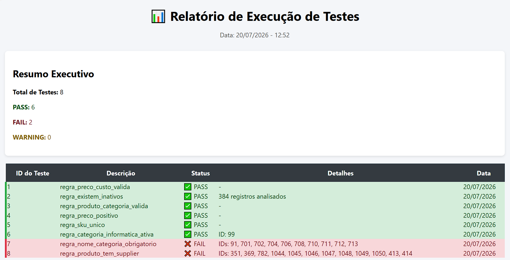
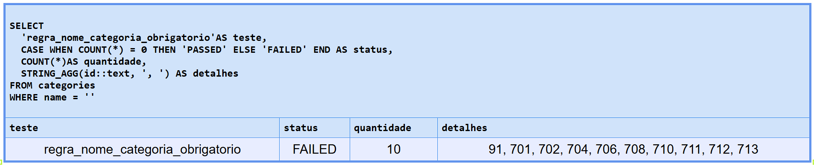
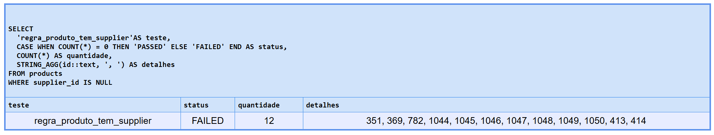

# Relatório de Execução — Suite de Testes SQL
 
> **Projeto:** SQL & Banco de Dados para QA  
> **Banco:** Supabase Northwind (PostgreSQL)  
> **Data de execução:** 2026-07-20  
> **Executado por:** [seu nome]  
> **Script:** [`Suite de Testes em SQL`](../relatorio-de-execucao/evidencias/suite-de-testes.sql)

---
 
## 📊 Resultado Consolidado
 
| # | Teste | Status | Qtd | Detalhes |
|---|---|---|---|---|
| 01 | regra_preco_custo_valida | ✅ PASSED | 0 | — |
| 02 | regra_existem_inativos | ✅ PASSED | 384 | — |
| 03 | regra_produto_categoria_valida | ✅ PASSED | 0 | — |
| 04 | regra_preco_positivo | ✅ PASSED | 0 | — |
| 05 | regra_sku_unico | ✅ PASSED | 0 | — |
| 06 | regra_categoria_informatica_ativa | ✅ PASSED | 1 | 99 |
| 07 | regra_nome_categoria_obrigatorio | ❌ FAILED | 10 | IDs: 91,701,702,704,706,708,710,711,712,713 |
| 08 | regra_produto_tem_supplier | ❌ FAILED | 2 | IDs: 351,369,782,1044,1046,1047,1048,1049,1050,413,414 |
 
> **Evidência da execução completa:**  

>   
> *Figura 1 — Output completo da suite executada no DBeaver*
 
---
 
## ✅ Testes que Passaram (6/8)
 
Todos os 6 testes abaixo retornaram **PASSED** — regras de negócio respeitadas.
 
| Teste | O que valida |
|---|---|
| regra_preco_custo_valida | Nenhum produto ativo com price < cost_price |
| regra_existem_inativos | Banco possui produtos inativos (soft delete ativo) |
| regra_produto_categoria_valida | Todos os produtos têm categoria válida |
| regra_preco_positivo | Nenhum produto ativo com preço zero ou negativo |
| regra_sku_unico | Nenhum SKU duplicado no banco |
| regra_categoria_informatica_ativa | Categoria 'informatica' existe e está ativa |
 
--- 
## Testes que Falharam (2/8) 
---
 
### BUG-001 — regra_nome_categoria_obrigatorio
 
**Título:**
`[DATABASE] Categoria cadastrada com nome nulo ou vazio`
 
**Critério Avaliado:**
Toda categoria deve ter o campo `name` obrigatoriamente preenchido — é exibido na navegação da loja e usado em filtros da API.
 
**Premissa/Entendimento:**
O formulário de cadastro de categoria deveria validar o campo `name` como obrigatório antes de persistir no banco. Categorias com nome vazio ou nulo tornam-se invisíveis ou quebram a navegação da loja.
 
**Defeito:**
1. Sistema permitiu salvar categoria com `name = NULL` ou `name = ''`
2. Validação de obrigatoriedade ausente no backend
**Query executada:**
```sql
SELECT 
  'regra_nome_categoria_obrigatorio'AS teste,
  CASE WHEN COUNT(*) = 0 THEN 'PASSED' ELSE 'FAILED' END AS status,
  COUNT(*)AS quantidade,
  STRING_AGG(id::text, ', ') AS detalhes
FROM categories
WHERE name = ''
```
 
**Resultado obtido:** `FAILED` — 10 registros encontrados
 
**Evidência — resultado do assert:**
>   
> *Figura 2 — Assert retornando FAILED com IDs dos registros afetados*

**Resultado Esperado:**
`PASSED` — 0 categorias com `name IS NULL` ou `TRIM(name) = ''`
 
**Resultado Atual:**
10 categorias com nome inválido persistidas no banco.
 
**Risco:**
1. Categoria exibida sem nome na loja — experiência do usuário comprometida
2. Filtros e integrações que dependem do campo `name` podem quebrar
3. Relatórios de categoria com dados inconsistentes

---
 
### BUG-002 — regra_produto_tem_supplier
 
**Título:**
`[DATABASE] Produto ativo cadastrado sem fornecedor vinculado`
 
**Critério Avaliado:**
Todo produto ativo deve ter `supplier_id` válido e não nulo — obrigatório para rastreabilidade de fornecedor e reposição de estoque.
 
**Premissa/Entendimento:**
A regra de negócio impede que um produto seja publicado sem estar vinculado a um fornecedor. O campo `supplier_id` é chave estrangeira obrigatória no cadastro de produto.
 
**Defeito:**
1. Sistema permitiu salvar produto ativo com `supplier_id = NULL`
2. Validação de obrigatoriedade ausente no formulário de cadastro
3. Constraint `NOT NULL` ausente na coluna `supplier_id`
**Query executada:**
```sql
SELECT 
  'regra_produto_tem_supplier'AS teste,
  CASE WHEN COUNT(*) = 0 THEN 'PASSED' ELSE 'FAILED' END AS status,
  COUNT(*) AS quantidade,
  STRING_AGG(id::text, ', ') AS detalhes
FROM products
WHERE supplier_id IS NULL
```
 
**Resultado obtido:** `FAILED` — 12 registros encontrados
 
**Evidência — resultado do assert:**
>   
> *Figura 3 — Assert retornando FAILED com IDs dos produtos sem fornecedor*
 
**Resultado Esperado:**
`PASSED` — 0 produtos com `supplier_id IS NULL`
 
**Resultado Atual:**
12 produtos ativos sem fornecedor vinculado.
 
**Risco:**
1. Produto publicado sem rastreabilidade de fornecedor
2. Impossibilidade de acionar reposição automática de estoque
3. Relatórios de fornecedor com volume de produtos incorreto

---
 
## Ações Sugeridas
 
| Bug | Ação Imediata | Ação Preventiva |
|---|---|---|
| BUG-001 | Preencher nome das categorias afetadas | Validar `name NOT NULL` no formulário |
| BUG-002 | Vincular produtos ao fornecedor correto | Adicionar `NOT NULL constraint` na coluna |
 
---
 
## Histórico e Próximas ações
 
| Data | Ação |
|---|---|
| 2026-07-20 | Suite executada — 6 PASSED, 2 FAILED |
| 2026-07-21 | BUG-001 e BUG-002 abertos |
| | BUG-001 corrigido |
| | BUG-002 corrigido |
| | Re-execução da suite — todos PASSED |
 
---
 
*Projeto: [SQL & Banco de Dados para QA](../README.md)*